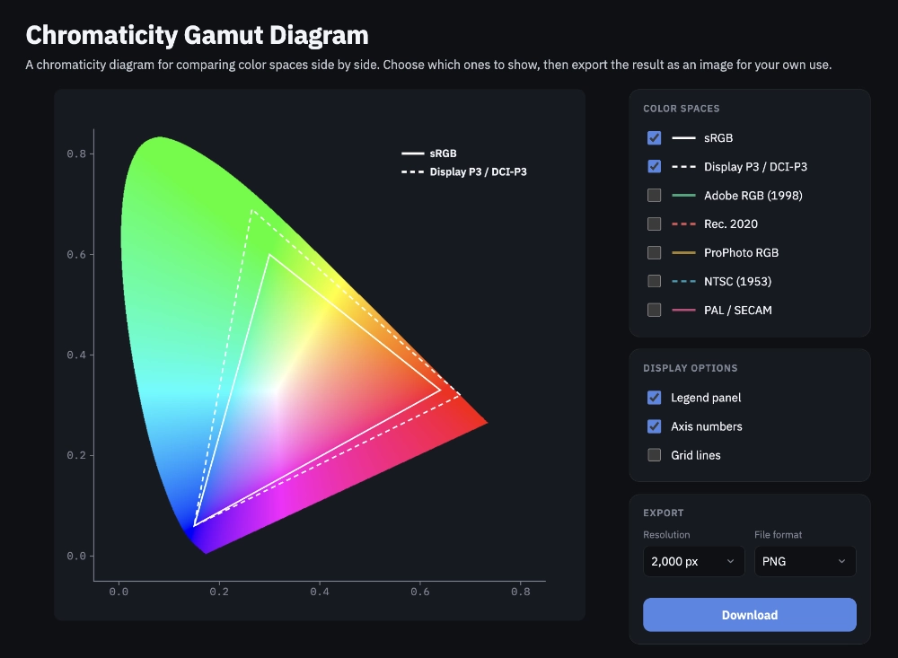

# Chromaticity Gamut Diagram

**[chromaticity.akexorcist.dev](https://chromaticity.akexorcist.dev)**



## Purpose

A chromaticity diagram for comparing RGB color-space gamuts (sRGB, Display
P3, Adobe RGB, Rec. 2020, ProPhoto RGB, NTSC, PAL/SECAM) against the full
range of human-visible color. Choose which color spaces and display options
to show, then export the result as a PNG or WebP image.

Powered by Svelte + TypeScript + Vite.

## How to run

```sh
npm install
npm run dev
```

Build for production:

```sh
npm run build
npm run preview
```

Run checks:

```sh
npm run check   # type checking
npm test        # unit tests
```

## License

Licensed under the [Apache License 2.0](LICENSE).
